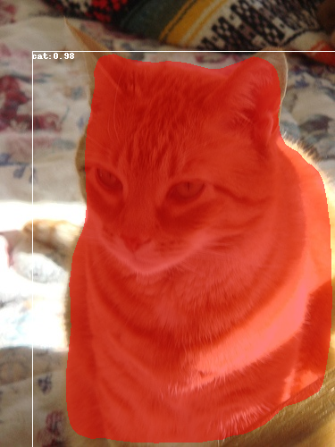
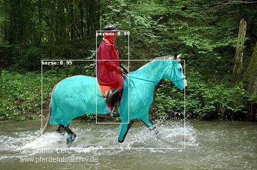
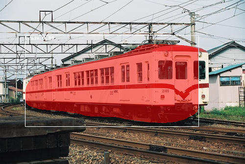
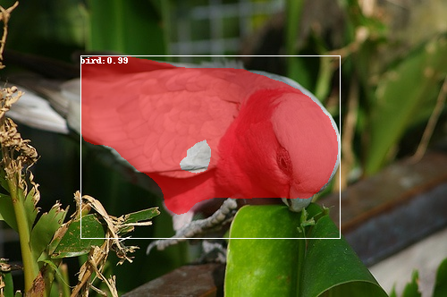
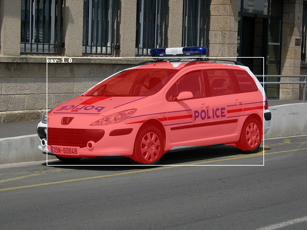
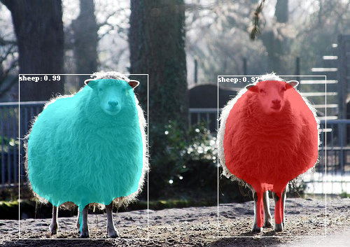

## Mask RCNN for VOC dataset

### 1.Usage

To train model on VOC dataset on pretrained coco dataset, run:

```
python3 voc.py train --train_data="path/to/train/images" --val_data="path/to/val/images" --weights=="coco"
```

To Inference, just run:

```
python3 voc.py inference --weights="path/to/weight_file" --image="path/to/detection/image" --name="image_name"
```

### 2. Result

Here's some result on Instance Segmentation














### 3. Evaluation

In progress, later release.